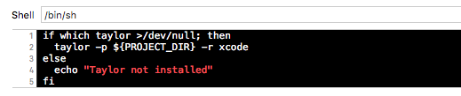

# Taylor

A tool aimed to increase Swift code quality, based on many rules from
[OCLint](https://github.com/oclint/oclint).

Taylor uses [SourceKitten](https://github.com/S2dentik/SourceKitten) to a more
accurate [AST](http://clang.llvm.org/docs/IntroductionToTheClangAST.html)
representation and produces the final report in either **Xcode, JSON, PMD** or **plain text** formats.

## Installation

You can install Taylor by cloning the project and running `make install`
(**Xcode 7 Beta 6 or higher required**).

## Usage

### Xcode

Integrate Taylor into an Xcode scheme to get warnings displayed in the IDE. Just
add a new "Run Script Phase" with:

```bash
if which taylor >/dev/null; then
taylor -p ${PROJECT_DIR} -r xcode
else
echo "Taylor not installed"
fi
```


### Command line 

To use Taylor from command line run it as follows:

`taylor [option1 [option1_argument]] [option2 option2_argument] […]`

##### Available options

- `taylor -h`: Print **help**.
- `taylor -v`: Print Taylor **version**.
- `taylor -p path`: **Path** to the folder to be analysed (current folder by default).
- `taylor -e file`: Path to either **directory or file to be excluded** from analysis.
- `taylor -ef`: Path to **exclude file** in `.yml` format.
- `taylor -f`: File to be **included** in analysis (may be from an external source).
- `taylor -t`: **Type of files** to be analysed.
- `taylor -vl`: **Verbosity level** for output messages (info, warning and error).
- `taylor -r type:name`: Type of final report (**json, xcode, pmd** or **plain text**) and filename.
- `taylor -rc rule=value`: **Customize rules**by giving custom values. See [help](/Resources/help.txt) for more details.

`taylor` alone with **no arguments** analyses `.swift` files inside current folder.

### Excludes

Configure Taylor by creating a `.yml` file and calling Taylor with `taylor -ef /path/to/file`
argument enabled. The following excludes formats can be specified:

```yaml
- "/path/to/file"
- "file"
- "Folder"
- "Folder/*"
- ".*Tests.*"
```

## License

MIT Licensed.

